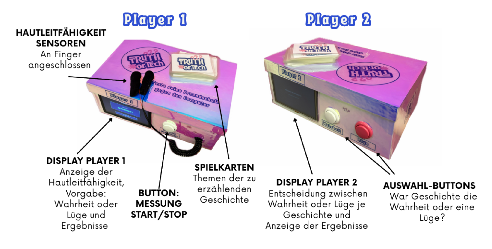

# Truth or Tech

> Can human intuition beat biofeedback technology at detecting lies?

**Truth or Tech** is a two-player party game that pits human social intuition against a Raspberry Pi-based lie detector. One player tells stories (some true, some false) while their opponent and a computer algorithm compete to detect the lie. The computer analyzes **galvanic skin response (GSR)** data; the human relies on gut feeling.

Developed as part of the *Engineering Project for Psychologists* in the M.Sc. Human Factors program at TU Berlin.

## How It Works

1. **Player 1** is connected to a GSR sensor and receives a secret instruction: *Truth* or *Lie*
2. **Player 1** tells three stories while the sensor records physiological data throughout
3. **Player 2** listens and tries to guess which story was the lie
4. The **computer** analyzes GSR variance to make its own prediction
5. Results are revealed: who won, friendship or the machine?

## Built With

| Category | Tools |
|---|---|
| Language | Python |
| Hardware | Raspberry Pi, GSR Sensor, GPIO Buttons, 2x HDMI Displays |
| Libraries | pygame, RPi.GPIO, smbus2, statistics, random |
| Interface | Physical buttons, dual-display UI |

## Project Structure

- main.py: Main game loop and state machine
- game.py: Game logic and GSR analysis
- display.py: pygame UI rendering

## About the Technology

The lie detection is based on **Galvanic Skin Response (GSR)**, a measure of electrodermal activity linked to the sympathetic nervous system. When a person lies, subtle stress responses increase sweat gland activity, raising skin conductivity. The system calculates the **variance** of GSR values across each story and flags the one with the highest physiological activation as the likely lie.

Note: This is a game prototype, not a validated lie detector. Results are influenced by environmental conditions, individual physiology, and social dynamics.

## Test Results

Across 14 test runs:
- Both computer and human correct: 6x
- Both wrong: 4x
- Only computer correct: 3x
- Only human correct: 1x

The computer achieved ~64% accuracy, well above the 33% chance level.

## Team

Developed by Lilly Herbst, Clara Kosters, Sarah Preiwisch and Lisa Windisch
TU Berlin, M.Sc. Human Factors, 2025/26
